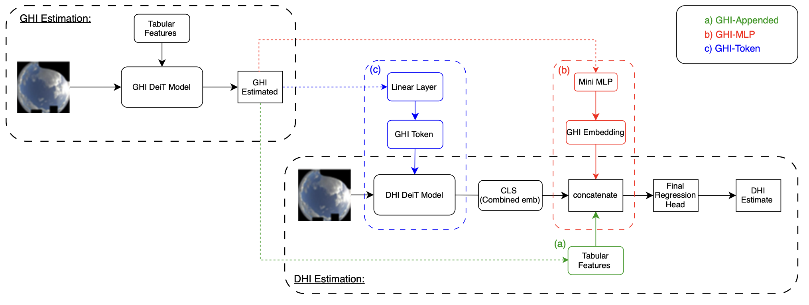

<!-- ─────────────────────────  HEADER  ───────────────────────── -->

<h1 align="center">Solar‑Irradiance ViT</h1>

  <em>Vision Transformers for Estimating Irradiance Using Data‑Scarce Sky Images</em>

  PyTorch Vision‑Transformer pipeline for data‑scarce solar‑irradiance estimation (DHI) from fisheye sky images — ETI/time features, cloud overlays, synthetic GHI.

  • <a href="https://doi.org/10.1016/j.egyai.2025.100560">📄 Paper</a>

  <!-- optional architecture / sample‑result image -->
  <!-- 560 px wide is a good balance for desktop & mobile -->
  

  <!-- DOI badge links to article -->
  
  <!-- journal badge -->
  
  <!-- stars -->
  
  <!-- python version -->
  

